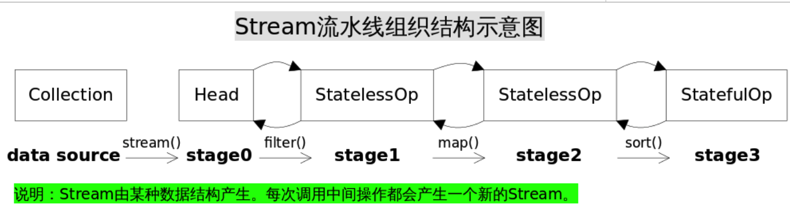
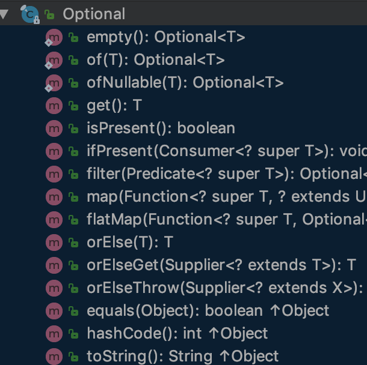

# 函数式编程之 - java8 lambda 实践


<!-- TOC -->

- [java8 lambda 实践](#java8-lambda-实践)
    - [1. 函数式编程](#1-函数式编程)
    - [2. 为什么引入lambda？](#2-为什么引入lambda)
        - [2.1. 使用()->{}替代匿名内部类](#21-使用-替代匿名内部类)
            - [2.1.1. 多线程](#211-多线程)
            - [2.1.2. 监听器](#212-监听器)
            - [2.1.3. 比较comparable与comparator](#213-比较comparable与comparator)
        - [2.2. 外部迭代到内部迭代](#22-外部迭代到内部迭代)
        - [2.3. 支持函数式编程](#23-支持函数式编程)
            - [2.3.1. 函数式编程](#231-函数式编程)
            - [2.3.2. 函数式接口](#232-函数式接口)
            - [2.3.2.1. 函数式接口使用](#2321-函数式接口使用)
            - [2.3.2.2. default方法](#2322-default方法)
            - [2.3.2.3. 常用的函数接口](#2323-常用的函数接口)
        - [2.4. 流式处理](#24-流式处理)
    - [3. 及早求值法与惰性求值法](#3-及早求值法与惰性求值法)
        - [3.1. 惰性求值法(延迟求值)](#31-惰性求值法延迟求值)
        - [3.2. 及早求值法](#32-及早求值法)
        - [3.3. 中间操作](#33-中间操作)
            - [3.3.1. 无状态和有状态](#331-无状态和有状态)
                - [无状态(Stateless)](#无状态stateless)
                - [有状态(Stateful)](#有状态stateful)
        - [3.4. 终结操作](#34-终结操作)
            - [3.4.1. 非短路与短路操作](#341-非短路与短路操作)
                - [非短路操作](#非短路操作)
                - [短路操作(short-circuiting)](#短路操作short-circuiting)
    - [3.5. 操作详解](#35-操作详解)
        - [flatMap](#flatmap)
        - [max & min](#max--min)
        - [reduce(count max min 都是reduce操作)](#reducecount-max-min-都是reduce操作)
        - [partitioningBy 将⼀一个集合分成两组](#partitioningby-将⼀一个集合分成两组)
        - [groupingBy 分组](#groupingby-分组)
        - [joining 拼接](#joining-拼接)
        - [computerIfAbsent computeIfPresent](#computerifabsent-computeifpresent)
    - [3.6. Stream原理](#36-stream原理)
        - [3.6.1. 流水线结构示意图](#361-流水线结构示意图)
        - [3.6.1.1. 流标志](#3611-流标志)
        - [3.6.1.2. 操作如何叠加？数据如何传递？](#3612-操作如何叠加数据如何传递)
            - [3.6.1.2.1. HEAD Stage0](#36121-head-stage0)
            - [3.6.1.2.2. 无状态中间操作filter](#36122-无状态中间操作filter)
            - [3.6.1.2.3. 有状态中间操作sorted](#36123-有状态中间操作sorted)
            - [3.6.1.2.4. 结束操作](#36124-结束操作)
            - [3.6.1.2.5. 结果收集collect](#36125-结果收集collect)
        - [3.6.1.3. 收集器](#3613-收集器)
            - [3.6.1.3.1. joining示例](#36131-joining示例)
        - [Sink协同工作](#sink协同工作)
        - [3.7. 并行流](#37-并行流)
        - [并行化操作](#并行化操作)
        - [3.8. 调试](#38-调试)
        - [3.9. 抛弃null判断 -> Optional使用](#39-抛弃null判断---optional使用)
        - [3.10. 响应式编程rxjava](#310-响应式编程rxjava)

<!-- /TOC -->

## 1. 函数式编程

> 它属于"结构化编程"的一种，主要思想是把运算过程尽量写成一系列嵌套的函数调用

* 数学表达式:

```text

(1 + 2) * 3 - 4

```

* 过程式编程:

```text

var a = 1 + 2;
var b = a * 3;
var c = b - 4;

```

* 函数式编程:

```text

var result = subtract(multiply(add(1,2), 3), 4);

```

> 函数跟其他数据类型一样,可以赋值给其他变量

```text

var print = function(i){
    console.log(i);
};

[1,2,3].forEach(print);

```

## 2. 为什么引入lambda？

### 2.1. 使用()->{}替代匿名内部类

#### 2.1.1. 多线程

```text

new Thread(new Runnable() {
     public void run() {
       System.out.println("Hello World!");
     }
   }).start();

new Thread(() -> System.out.println("Hello World!")).start();

```

#### 2.1.2. 监听器

```text

button.addActionListener(new ActionListener(){
    public void actionPerformed(ActionEvent event){
        System.out.println(“button clicked”)
    }
})

button.addActionListener(event -> System.out.println("button clicked"));

```

#### 2.1.3. 比较comparable与comparator

```text

@AllArgsConstructor
@Setter
@Getter
public class Person implements Comparable<Person> {

    private String name;
    private int age;

    @Override
    public int compareTo(Person person) {
        return this.name.compareTo(person.name);
    }

}

Person p1 = new Person("jack", 23);
Person p2 = new Person("tom", 30);
List<Person> personList = new ArrayList();
personList.add(p1);
personList.add(p2);
personList.sort(new Comparator<Person>() {
    @Override
    public int compare(Person o1, Person o2) {
        return o1.getName().compareTo(o2.getName());
    }
});

personList.sort((o1, o2) -> o1.getName().compareTo(o2.getName()));
personList.sort(Comparator.comparing(Person::getName));

```

### 2.2. 外部迭代到内部迭代

> **外部迭代 描述整个事件的方法, 类似于过程式编程的方式，顺序处理list中的元素**
> **java8之前的迭代⽅方式 for语法糖**

```text

List<Person> personList = new ArrayList<>();
personList.add(new Person("jack", 23));
personList.add(new Person("mike", 25));

int count = 0;
for (Person person : personList) {
    if (person.getAge() > 20){
        count ++;
    }
}

```

真正的实现 iterator

```text

int count = 0;
Iterator<Person> iterator = personList.iterator();
while(iterator.hasNext()) {
    Person person = iterator.next();
    if (person.getAge() > 20) {
        count++;
    }
}

```

内部迭代 描述需要做什么, 不一定按照顺序处理list, 不关心过程

```text

long count = personList.stream()
        .filter(p -> p.getAge() > 20)
        .count();

```

### 2.3. 支持函数式编程

#### 2.3.1. 函数式编程

```text
public class Test {

    public static void main(String[] args) {

        List<Person> personList = new ArrayList<>();
        personList.add(new Person("jack", 23));
        personList.add(new Person("mike", 25));
        personList.add(new Person("eric", 28));

        //找出20岁以上的
        filter(personList, p -> p.getAge() > 20);

        //找出名字中有字母i的
        filter(personList, p -> p.getName().contains("i"));

    }

    public static long filter(List<Person> personList, Predicate<Person> condition) {
        return personList.stream()
                .filter(condition)
                .count();
    }

}
```

#### 2.3.2. 函数式接口

1. 接口类型
2. 接口中只有一个抽象方法
3. 函数式接口里允许定义默认方法
4. 函数式接口里允许定义 text.lang.Object 里的 public 方法

```text

@FunctionalInterface
public interface HelloWorld {

    void say(String message);

    default void say2(String message){
        System.out.println(message);
    }

    @Override
    boolean equals(Object obj);

}

```

#### 2.3.2.1. 函数式接口使用

```text

public class Test {

    public static void main(String[] args) {
        HelloWorld sayHello = message -> System.out.println("hello:" + message);
        List<String> messageList = new ArrayList<>();
        messageList.add("jack");
        messageList.add("mike");
        messageList.forEach(sayHello::say);
    }

}

hello:jack
hello:mike
```

#### 2.3.2.2. default方法

default很巧妙

	1.在接口添加新功能特性, 不影响实现类
	2.接口中可以实现方法
	3.两个或多个接口都有一个同名的default接口方法，从而造成冲突。因为Java虚拟机在程序运行时，并不清楚你要使用哪一个default方法。这会导致编译错误。

#### 2.3.2.3. 常用的函数接口

| 接⼝ | 入参 -> 函数 -> 返回类型 | 作⽤ |  示例 |
| --- | --- | --- | --- |
| Predicate<T> |T -> Predicate -> boolean  | 判断 |  Predicate<Integer> atLeast5 = x -> x > 5;|
| Consumer<T> | T -> Consumer -> void |  消费| Consumer<Integer> logout = x -> System.out.println(x); |
| Function<T,R> | T -> Function -> R | 转换 | Function<Integer,Integer> addOne = x -> x + 1; |
| Supplier<T> | None -> T | 生产 | Supplier<Integer> createNum = () -> new Random().nextInt(); |
| UnaryOperator<T> | T | 一元操作符,继承Function | UnarayOperator<Boolean> not = true -> false |
| BinaryOperator<T> | T | 二元操作符,继承Function | BinaryOperator<Integer> add = (x,y) -> x+y |

1.Predicate

```text

@FunctionalInterface
public interface Predicate<T> {

    /**
     * Evaluates this predicate on the given argument.
     *
     * @param t the input argument
     * @return {@code true} if the input argument matches the predicate,
     * otherwise {@code false}
     */
    boolean test(T t);
    ...

}

```

2.Cousumer

```text

@FunctionalInterface
public interface Consumer<T> {

    /**
     * Performs this operation on the given argument.
     *
     * @param t the input argument
     */
    void accept(T t);
    ...
    
}

```

3.Function

```text

@FunctionalInterface
public interface Function<T, R> {

    /**
     * Applies this function to the given argument.
     *
     * @param t the function argument
     * @return the function result
     */
    R apply(T t);
    ...
}

```

4.Supplier

```text

@FunctionalInterface
public interface Supplier<T> {

    /**
     * Gets a result.
     *
     * @return a result
     */
    T get();
}

```

### 2.4. 流式处理

方便、简洁、高效

```text

return personList.stream()
                .filter(condition)
                .count();

```

## 3. 及早求值法与惰性求值法

### 3.1. 惰性求值法(延迟求值)

最终不产生新的集合的方法

> 在使用延迟求值的时候，表达式不在它被绑定到变量之后就立即求值，而是在该值被取用的时候求值

语句如x:=expression; (把一个表达式的结果赋值给一个变量)明显的调用这个表达式被计算并把结果放置到x中，但是先不管实际在x中的是什么，直到通过后面的表达式中到x的引用而有了对它的值的需求的时候，而后面表达式自身的求值也可以被延迟，最终为了生成让外界看到的某个符号而计算这个快速增长的依赖树。

```text

personList.stream()
    .filter(person -> person.getAge() > 20);

```

### 3.2. 及早求值法

> 在及早求值中，表达式在它被约束到变量的时候就立即求值

```python

x = 5 + 3 * (1 + 5 ^ 2)
print x
print x + 2

```

> 因为第一行代码 `x = 5 + 3 * (1 + 5 ^ 2)` 执行完成后 x 被赋值并存储为 83，表达式所占用的空间可以立即释放> 掉，所以节省了内存空间。接下来的两行代码执行时都需要使用 x 的值，此时 x 是可以直接用于运算的数值 83 而不是> 需要计算的表达式 5 + 3 * (1 + 5 ^ 2)，所以减少了一次计算过程，提高了执行效率。对于惰性求值的编程语言，由> 于记忆化（memoization）特性，求值过程与之不同。

```text

 long count = personList.stream()
                .filter(person -> person.getAge() > 20)
                .count();

```

**注**：判断一个操作是惰性操作还是及早求值，只需看它的返回值。如果返回值是Stream，那么是惰性求值；如果返回值是另一个值或者为空，那就是及早求值。这些操作的理想方式就是形成一个惰性求值的链，最后用一个及早求值的操作返回想要的结果。

### 3.3. 中间操作

中间操作返回一个新的 stream 并且总是缓求值的，例如 filter 并不会真的执行过滤操作，只是生成一个新的 stream

#### 3.3.1. 无状态和有状态

中间操作又进一步被分为有状态和无状态操作。无状态操作可以独立的处理每个元素，并不依赖之前的元素，如：filter、map；而有状态的操作在处理元素时，必须依赖并保存之前元素的状态，如：distinct、sorted

##### 无状态(Stateless)

    * unordered()
    * filter()
    *  map()
    *  mapToInt()
    *  mapToLong()
    *  mapToDouble()
    *  flatMap()
    *  flatMapToInt()
    *  flatMapToLong()
    *  flatMapToDouble()
    *  peek()

##### 有状态(Stateful)

    * distinct()
    * sorted()
    * limit()
    * skip()

### 3.4. 终结操作

终结操作遍历 stream，产生结果和副作用，如 forEach，collect。

#### 3.4.1. 非短路与短路操作

短路操作是指一旦满足条件语句将不再执行下去，不一定操作整个流就可以结束

##### 非短路操作

    * forEach()
    * forEachOrdered()
    * toArray()
    * reduce()
    * collect()
    * max()
    * min()
    * count()

##### 短路操作(short-circuiting)

    * anyMatch()
    * allMatch()
    * noneMatch()
    * findFirst()
    * findAny()

## 3.5. 操作详解

### flatMap

```text

List<Integer> together = Stream.of(asList(1, 2), asList(3, 4))
                                .flatMap(numbers -> numbers.stream())
                                .collect(toList())

```

### max & min

```text

List<Track> tracks = asList(new Track("Bakai", 524),
                             new Track("Violets for Your Furs", 378),
                             new Track("Time Was", 451));
 Track shortestTrack = tracks.stream()
                             .min(Comparator.comparing(track -> track.getLength()))
                             .get();

```

### reduce(count max min 都是reduce操作)

```text

int count = Stream.of(1, 2, 3)
                        .reduce(0, (acc, element) -> acc + element);

```

### partitioningBy 将⼀一个集合分成两组

```text

public Map<Boolean, List<Artist>> bandsAndSolo(Stream<Artist> artists) {
     return artists.collect(partitioningBy(artist -> artist.isSolo()));
}

```

### groupingBy 分组

```text

public Map<Artist, List<Album>> albumsByArtist(Stream<Album> albums) {
          return albums.collect(groupingBy(album -> album.getMainMusician()));
}
 public Map<Artist, Long> numberOfAlbums(Stream<Album> albums) {
     return albums.collect(groupingBy(album -> album.getMainMusician(),counting()));
}
 public Map<Artist, List<String>> nameOfAlbums(Stream<Album> albums) {
     return albums.collect(groupingBy(Album::getMainMusician,mapping(Album::getName, toList())));
}

```

### joining 拼接

```text

[George Harrison, John Lennon, Paul McCartney, Ringo Starr, The Beatles]
 String result =
          artists.stream()
                    .map(Artist::getName)
                    .collect(Collectors.joining(", ", "[", "]"));

```

### computerIfAbsent computeIfPresent

```text

default V computeIfAbsent(K key,
        Function<? super K, ? extends V> mappingFunction) {
    Objects.requireNonNull(mappingFunction);
    V v;
    if ((v = get(key)) == null) {
        V newValue;
        if ((newValue = mappingFunction.apply(key)) != null) {
            put(key, newValue);
            return newValue;
        }
    }
    return v;
}

default V computeIfPresent(K key,
        BiFunction<? super K, ? super V, ? extends V> remappingFunction) {
    Objects.requireNonNull(remappingFunction);
    V oldValue;
    if ((oldValue = get(key)) != null) {
        V newValue = remappingFunction.apply(key, oldValue);
        if (newValue != null) {
            put(key, newValue);
            return newValue;
        } else {
            remove(key);
            return null;
        }
    } else {
        return null;
    }
}

```

## 3.6. Stream原理

### 3.6.1. 流水线结构示意图



Collection.stream()方法得到Head也就是stage0,后续中间操作不断产生新的Stream。这些Stream对象以双向链表的形式组织在一起，构成整个流水线，由于每个Stage都记录了前一个Stage和本次的操作以及回调函数，依靠这种结构就能建立起对数据源的所有操作。这就是Stream记录操作的方式。

### 3.6.1.1. 流标志

| 流标志 | 解释 |
| --- | --- |
|SIZED  |流的大小已知。  |
| DISTINCT | 依据用于对象流的 Object.equals() 或用于原语流的 ==，流的元素将有所不同。 |
| SORTED |流的元素按自然顺序排序。  |
| ORDERED | 流有一个有意义的遇到顺序 |

每个中间操作都对流标志具有已知的影响；一个操作可设置、清除或保留每个标志的设置。例如，filter() 操作保留 SORTED 和 DISTINCT 标志，但清除 SIZED 标志；map() 操作清除 SORTED 和 DISTINCT 标志，但保留 SIZED 标志；sorted() 操作保留 SIZED 和 DISTINCT 标志，但注入 SORTED 标志。构造阶段的链接列表表示时，会将前一个阶段的标志与当前阶段的行为相组合，以获得当前阶段的一组新标志。

示例:

``` text

Person p1 = personList.stream()
            .filter(p -> p.getAge() > 20)
            .sorted()
            .findAny()
            .get();

personList.stream()
        .filter(p -> p.getAge() > 20)
        .collect(Collectors.toList());

```

### 3.6.1.2. 操作如何叠加？数据如何传递？

#### 3.6.1.2.1. HEAD Stage0

```text

spliterator - 访问来源的元素（迭代）
StreamOpFlag.fromCharacteristics(spliterator) - 将spliterator特征位设置转换为流标志。
parallel - 是否是并行处理

public static <T> Spliterator<T> spliterator(Collection<? extends T> c,
                                             int characteristics) {
    return new IteratorSpliterator<>(Objects.requireNonNull(c),
                                     characteristics);
}

public static <T> Stream<T> stream(Spliterator<T> spliterator, boolean parallel) {
    Objects.requireNonNull(spliterator);
    return new ReferencePipeline.Head<>(spliterator,
                                        StreamOpFlag.fromCharacteristics(spliterator),
                                        parallel);
}

```

#### 3.6.1.2.2. 无状态中间操作filter

```text

public final Stream<P_OUT> filter(Predicate<? super P_OUT> predicate) {
    Objects.requireNonNull(predicate);
    return new StatelessOp<P_OUT, P_OUT>(this, StreamShape.REFERENCE,
                                 StreamOpFlag.NOT_SIZED) {
        @Override
        Sink<P_OUT> opWrapSink(int flags, Sink<P_OUT> sink) {
            return new Sink.ChainedReference<P_OUT, P_OUT>(sink) {
                @Override
                public void begin(long size) {
                    downstream.begin(-1);
                }

                @Override
                public void accept(P_OUT u) {
                    if (predicate.test(u))
                        downstream.accept(u);
                }
            };
        }
    };
}

```

#### 3.6.1.2.3. 有状态中间操作sorted

```text

/**
 * {@link Sink} for implementing sort on reference streams.
 */
private static final class RefSortingSink<T> extends AbstractRefSortingSink<T> {
    private ArrayList<T> list;

    RefSortingSink(Sink<? super T> sink, Comparator<? super T> comparator) {
        super(sink, comparator);
    }

    @Override
    public void begin(long size) {
        if (size >= Nodes.MAX_ARRAY_SIZE)
            throw new IllegalArgumentException(Nodes.BAD_SIZE);
        list = (size >= 0) ? new ArrayList<T>((int) size) : new ArrayList<T>();
    }

    @Override
    public void end() {
        list.sort(comparator);
        downstream.begin(list.size());
        //判断下游是否有短路操作,如果没有则直接传
        if (!cancellationWasRequested) {
            list.forEach(downstream::accept);
        } else { 
            for (T t : list) {
                //判断是否可以结束处理
                if (downstream.cancellationRequested()) break;
                downstream.accept(t);
            }
        }
        downstream.end();
        list = null;
    }

    @Override
    public void accept(T t) {
        list.add(t);
    }
}

```

#### 3.6.1.2.4. 结束操作

```text

final <P_IN> Sink<P_IN> wrapSink(Sink<E_OUT> sink) {
    Objects.requireNonNull(sink);

    for ( @SuppressWarnings("rawtypes") AbstractPipeline p=AbstractPipeline.this; p.depth > 0; p=p.previousStage) {
        //从下往上包装Sink
        sink = p.opWrapSink(p.previousStage.combinedFlags, sink);
    }
    //代表所有操作的sink
    return (Sink<P_IN>) sink;
}

```

```text

//包装
Sink<T> opWrapSink(int var1x, Sink<T> var2) {
        return new ChainedReference<T, T>(var2) {
            long n = var1;
            long m = var3 >= 0L ? var3 : 9223372036854775807L;

            public void begin(long var1x) {
                this.downstream.begin(SliceOps.calcSize(var1x, var1, this.m));
            }

            public void accept(T var1x) {
                if (this.n == 0L) {
                    if (this.m > 0L) {
                        --this.m;
                        this.downstream.accept(var1x);
                    }
                } else {
                    --this.n;
                }

            }

            public boolean cancellationRequested() {
                return this.m == 0L || this.downstream.cancellationRequested();
            }
        };
    }
};

```

```text

final <P_IN> void copyInto(Sink<P_IN> wrappedSink, Spliterator<P_IN> spliterator) {
    Objects.requireNonNull(wrappedSink);

    if (!StreamOpFlag.SHORT_CIRCUIT.isKnown(getStreamAndOpFlags())) {
        //执行调用链
        //开始遍历
        wrappedSink.begin(spliterator.getExactSizeIfKnown());
        //迭代
        spliterator.forEachRemaining(wrappedSink);
        //遍历结束
        wrappedSink.end();
    }
    else {
        copyIntoWithCancel(wrappedSink, spliterator);
    }
}

```

```text

default void forEachRemaining(Consumer<? super T> action) {
    do { } while (tryAdvance(action));
}

public boolean tryAdvance(Consumer<? super E> action) {
    if (action == null)
        throw new NullPointerException();
    int hi = getFence(), i = index;
    if (i < hi) {
        index = i + 1;
        @SuppressWarnings("unchecked") E e = (E)list.elementData[i];
        action.accept(e);
        if (list.modCount != expectedModCount)
            throw new ConcurrentModificationException();
        return true;
    }
    return false;
}

```

#### 3.6.1.2.5. 结果收集collect

跟结束操作一样

```text

public final <R, A> R collect(Collector<? super P_OUT, A, R> collector) {
    A container;
    if (isParallel()
            && (collector.characteristics().contains(Collector.Characteristics.CONCURRENT))
            && (!isOrdered() || collector.characteristics().contains(Collector.Characteristics.UNORDERED))) {
        container = collector.supplier().get();
        BiConsumer<A, ? super P_OUT> accumulator = collector.accumulator();
        forEach(u -> accumulator.accept(container, u));
    }
    else {
        container = evaluate(ReduceOps.makeRef(collector));
    }
    return collector.characteristics().contains(Collector.Characteristics.IDENTITY_FINISH)
           ? (R) container
           : collector.finisher().apply(container);
}

final <R> R evaluate(TerminalOp<E_OUT, R> terminalOp) {
    assert getOutputShape() == terminalOp.inputShape();
    if (linkedOrConsumed)
        throw new IllegalStateException(MSG_STREAM_LINKED);
    linkedOrConsumed = true;

    return isParallel()
           ? terminalOp.evaluateParallel(this, sourceSpliterator(terminalOp.getOpFlags()))
           : terminalOp.evaluateSequential(this, sourceSpliterator(terminalOp.getOpFlags()));
}
```

### 3.6.1.3. 收集器

```text

private final Supplier<A> supplier;
private final BiConsumer<A, T> accumulator;
private final BinaryOperator<A> combiner;
private final Function<A, R> finisher;
private final Set<Characteristics> characteristics;

CollectorImpl(Supplier<A> supplier,
              BiConsumer<A, T> accumulator,
              BinaryOperator<A> combiner,
              Function<A,R> finisher,
              Set<Characteristics> characteristics) {
    this.supplier = supplier;       //提供者生产者
    this.accumulator = accumulator; //累加器
    this.combiner = combiner;      //组合
    this.finisher = finisher;      //结束
    this.characteristics = characteristics;
}

```

#### 3.6.1.3.1. joining示例

```text

public static Collector<CharSequence, ?, String> joining(CharSequence delimiter,
                                                         CharSequence prefix,
                                                         CharSequence suffix) {
    return new CollectorImpl<>(
            () -> new StringJoiner(delimiter, prefix, suffix),
            StringJoiner::add, StringJoiner::merge,
            StringJoiner::toString, CH_NOID);
}

//supplier
public StringJoiner(CharSequence delimiter,
                    CharSequence prefix,
                    CharSequence suffix) {
    Objects.requireNonNull(prefix, "The prefix must not be null");
    Objects.requireNonNull(delimiter, "The delimiter must not be null");
    Objects.requireNonNull(suffix, "The suffix must not be null");
    // make defensive copies of arguments
    this.prefix = prefix.toString();
    this.delimiter = delimiter.toString();
    this.suffix = suffix.toString();
    this.emptyValue = this.prefix + this.suffix;
}

//accumulator
public StringJoiner add(CharSequence newElement) {
    prepareBuilder().append(newElement);
    return this;
}

//combiner
public StringJoiner merge(StringJoiner other) {
    Objects.requireNonNull(other);
    if (other.value != null) {
        final int length = other.value.length();
        // lock the length so that we can seize the data to be appended
        // before initiate copying to avoid interference, especially when
        // merge 'this'
        StringBuilder builder = prepareBuilder();
        builder.append(other.value, other.prefix.length(), length);
    }
    return this;
}

//finisher
public String toString() {
    if (value == null) {
        return emptyValue;
    } else {
        if (suffix.equals("")) {
            return value.toString();
        } else {
            int initialLength = value.length();
            String result = value.append(suffix).toString();
            // reset value to pre-append initialLength
            value.setLength(initialLength);
            return result;
        }
    }
}

//空类型 CH_NOID
static final Set<Collector.Characteristics> CH_NOID = Collections.emptySet();

```

### Sink协同工作

1. 首先beging()方法告诉Sink参与排序的元素个数，方便确定中间结果容器的的大小；
2. 之后通过accept()方法将元素添加到中间结果当中，最终执行时调用者会不断调用该方法，直到遍历所有元素；
3. 最后end()方法告诉Sink所有元素遍历完毕，启动排序步骤，排序完成后将结果传递给下游的Sink；
4. 如果下游的Sink是短路操作，将结果传递给下游时不断询问下游cancellationRequested()是否可以结束处理。

### 3.7. 并行流

>**基于fork/join框架**
>对数据进行fork拆分,并且通过join进行组合结果

1. 数据量大的时候使用并行流
2. 限制
     - 算法需要满足结合律
     - 避免持有锁
3. 无状态 有状态
4. 有状态需要维护状态所需开销和限制, 无状态的性能高, 尽量使用无状态操作
    - 性能好 ArrayList 数组 IntStream.range
    - 性能一般 HashSet TreeSet
    - 性能差 LinkedList

### 并行化操作

parallelPrefix parallelSetAll parallelSort

### 3.8. 调试

使用peek() 进行日志记录和断点设置

### 3.9. 抛弃null判断 -> Optional使用



### 3.10. 响应式编程rxjava

后续分享
