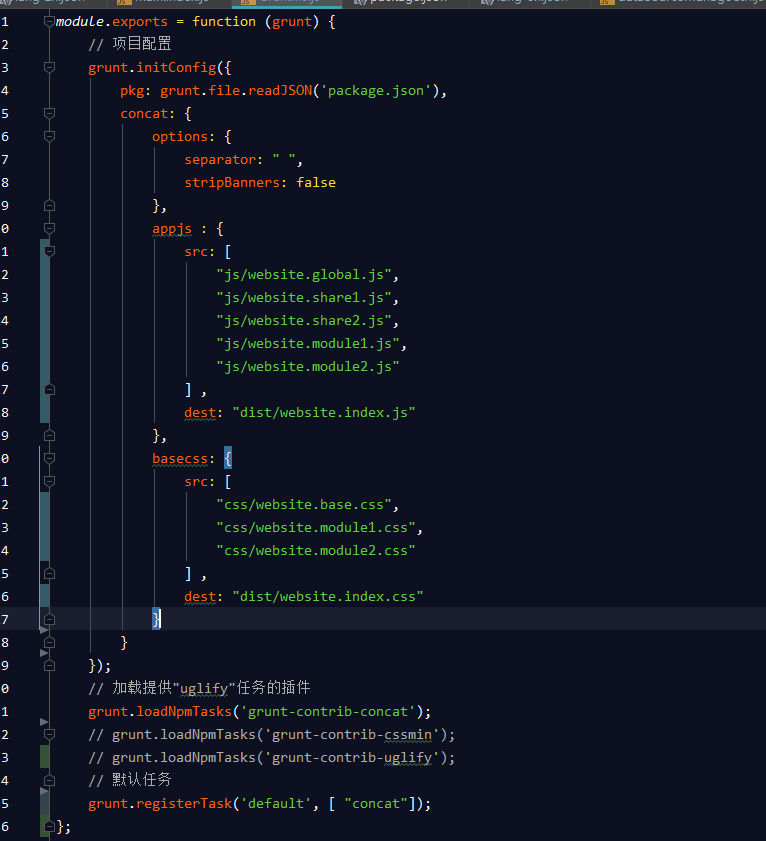
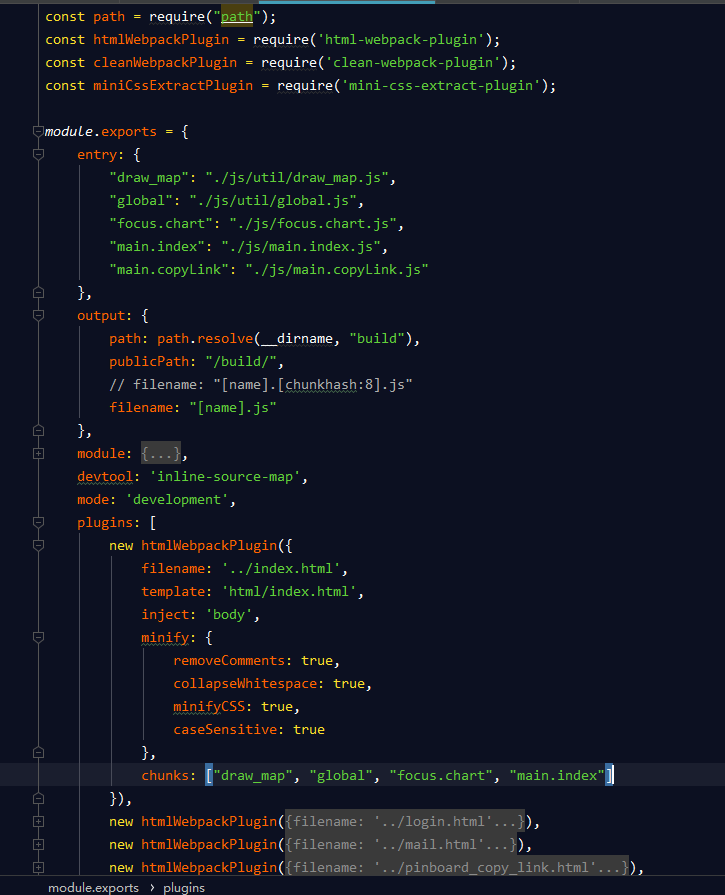

# 前端工程管理工具的使用 从 grunt 到 webpack

##前端打包工具

前期准备：

    1. 安装全局 npm
    2. 使用grunt需要用npm在你的工程目录里 安装 grunt 和 grunt-cli
    3. 使用webpack需要用npm在你的工程目录里安装webpack 和 webpack-cli

- Grunt

    ~~~
    在前端代码 css / js 越来越多的情况下，我们为了更好的管理，需要对代码进行分割

    css 例：

        1. 公共的css  ( website.base.css )
        2. 各个模块的 css ( website.module1.css , website.module2.css )

    js 例：

        1. 全局公用的js ( website.global.js ) ,
        2. 公共模块的 js ( website.share1.js , website.share2.js )
        3. 各个模块的业务逻辑 js ( website.module1.js , website.module2.js )

    开发模式中我们可以分模块,分页面管理自己的css/js ,  
    但是在页面上引用的时候，为了尽量减少页面静态资源的请求，我们会通过工具将所有的资源打包在一个文件中，供页面调用 

    代码检查/代码合并/压缩 这些操作 grunt 提供了一些列的工具帮我们完成,如下Gruntfile.js： 
    ~~~

~~~

    我们使用了grunt主要用于合并压缩文件，但是在合并或者引入时需要注意文件的顺序，因为一些基础文件需要在之前引入，就还是原始的JS的玩法

    所以新手介入时需要了解每个JS的功能 以及再整个工程中的先后顺序

    再代码量少时grunt可以胜任，但是工程一旦大起来，就比较费劲
    
~~~

- webapck

~~~

    webpack的引入主要是为了将JS代码模块，在模块中可以通过import引入其他的模块的方法，供其使用。
    
    最后webpack会将其打包成对应的文件供页面使用，这样程序员不需要关心每个代码之前的顺序，只需要关注于功能

    Js代码需要做的调整：

        1. 每个部分的代码都不再是往全局对象中增加方法 或者属性了 
        
            而是通过 module.exports = {} 输出一个模块对象

        2. 在模块中需要应用别的模块时，通过 import './website.base.js' 就可以在当前模块中使用了

        3. 也可以用 import 引入一些npm 中的组件  

            例： npm install vue 后 可以直接在代码中 import Vue from 'vue' 

                webpack打包时会自动去找node-modules中去找对应的 vue 组件    

    webpack对应的打包文件 例：

~~~

 

